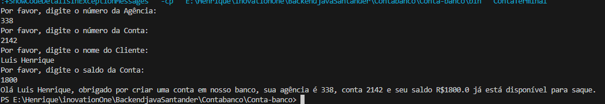

# ContaTerminal

## Sobre o Projeto
O projeto `ContaTerminal` é uma aplicação Java simples que simula a criação de uma conta bancária e a exibição de um extrato bancário. O programa permite que o usuário insira dados como número da agência, número da conta, nome do cliente e saldo através do terminal.

## Como Executar
Para executar o programa, siga os passos abaixo:

1. Certifique-se de ter o Java instalado em seu sistema.
2. Compile o código usando o comando `javac ContaTerminal.java`.
3. Execute o programa com o comando `java ContaTerminal`.

## Entrada de Dados
O programa solicitará as seguintes informações:

- Número da Agência
- Número da Conta
- Nome do Cliente
- Saldo da Conta

Insira cada informação conforme solicitado pelo programa e pressione ENTER após cada entrada.

## Saída Esperada
Após a inserção de todos os dados, o programa exibirá uma mensagem semelhante a esta: 
Olá [Nome do Cliente], obrigado por criar uma conta em nosso banco, sua agência é [Número da Agência], conta [Número da Conta] e seu saldo R$[Saldo] já está disponível para saque.

## Contribuições
Contribuições são sempre bem-vindas! Para contribuir, por favor, abra um issue ou envie um pull request.

## Licença
Distribuído sob a licença MIT. Veja `LICENSE` para mais informações.

## Contato
Luis Henrique - l.henrique.b.g.filho@gmail.com